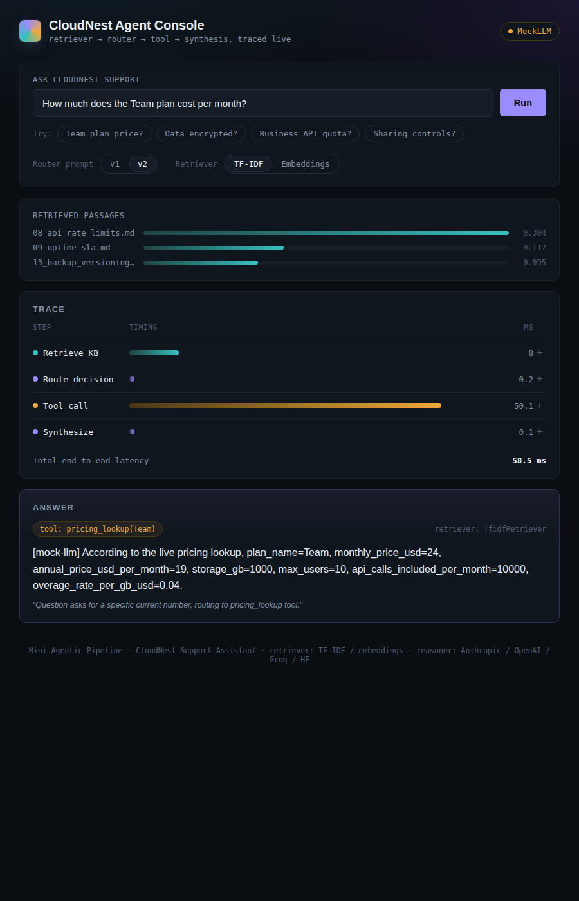
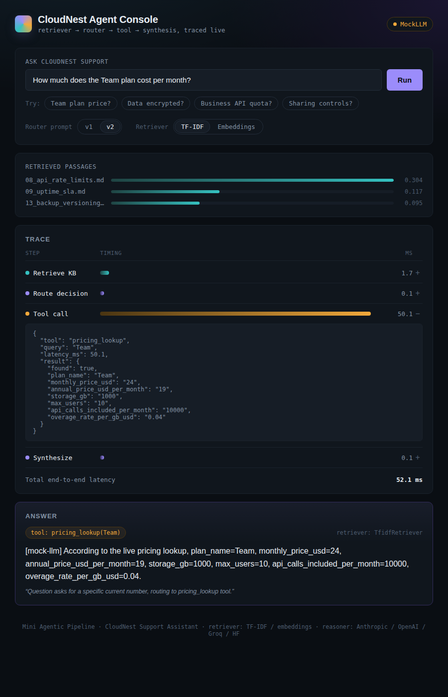
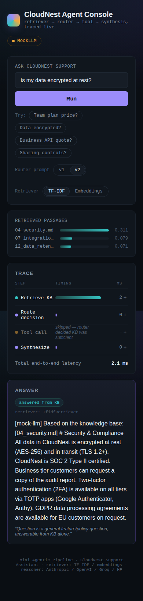
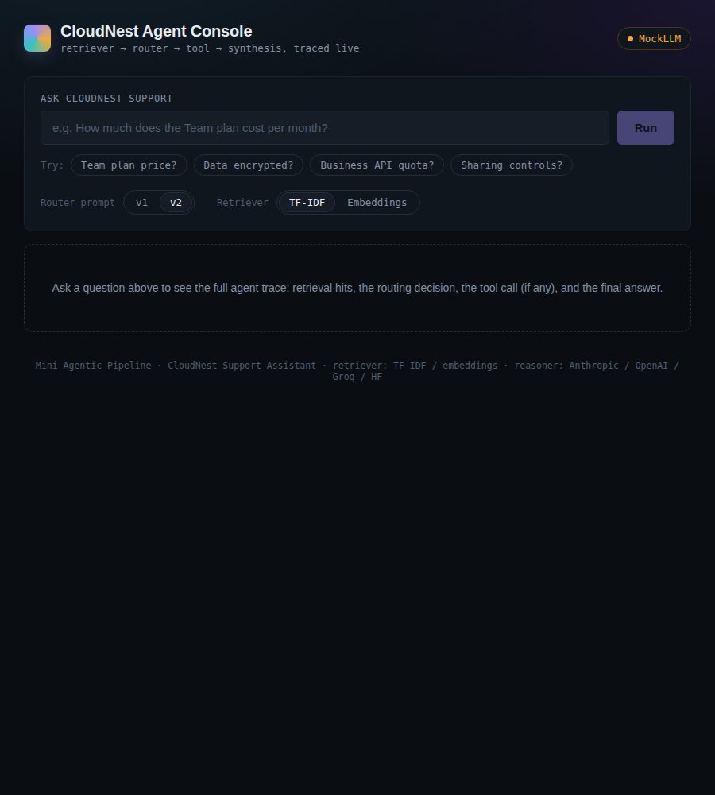

# Mini Agentic Pipeline — CloudNest Support Assistant

A small agentic pipeline that answers questions about a fictional SaaS product ("CloudNest") by
combining a knowledge-base retriever, an LLM reasoner that decides whether it needs a tool, and a
CSV-backed "live pricing API" tool — with a full step-by-step trace logged for every query.

> ### 🎥 Video walkthrough
> **`>>> PASTE YOUR LOOM/YOUTUBE LINK HERE BEFORE SUBMITTING <<<`**
> *(5-8 min: architecture, code walkthrough, live demo on 3-4 queries, and honest learnings)*

---

## Screenshots

The React UI (see §9) renders the agent's full reasoning trace as a live waterfall — each step
timed and color-coded by the kind of work it does (teal = reading stored KB data, violet = LLM
reasoning, amber = a live tool call).

**Tool-routed query** — the router recognized this needs a live number and called `pricing_lookup`:


**Expanded trace detail** — clicking any step shows its raw JSON, e.g. the tool call's input/output:


**KB-only query on mobile** — the router correctly skipped the tool for a general feature question:


**Empty state / initial load:**


> Note: the screenshots above were captured during development using the `MockLLM` fallback (see
> §4), so the router's `reason` text reads a bit more mechanically than a real model's. Consider
> swapping in 1-2 screenshots from an actual Groq/OpenAI/Anthropic-backed run before final
> submission for a more natural demonstration — the UI and trace structure are identical either way.

---

## 1. Why this domain

Support/FAQ assistants are a natural fit for the KB-vs-tool decision this assignment asks for:
- Feature, security, and policy questions are static → answerable from the knowledge base.
- Pricing, quota, and limit questions change often → the KB explicitly refuses to state exact
  numbers and defers to "the live pricing system," forcing the agent to genuinely decide to call
  a tool rather than just always calling it or never calling it.

## 2. Architecture

```
                 ┌─────────────┐
   question ───► │  Retriever   │  TF-IDF search over 15 KB docs → top-k passages
                 └──────┬──────┘
                        │ kb_results
                        ▼
                 ┌─────────────┐
                 │  Reasoner    │  router_v2.txt prompt → LLM decides:
                 │  (router)    │  {use_tool, tool_query, reason}   [JSON]
                 └──────┬──────┘
                        │
          use_tool=True │  use_tool=False
                        ▼
                 ┌─────────────┐
                 │    Actor     │  PricingTool.lookup(plan) → reads data/prices.csv
                 │ (CSV "API")  │  (simulated network latency, structured result)
                 └──────┬──────┘
                        │ tool_output (or None if skipped)
                        ▼
                 ┌─────────────┐
                 │  Reasoner    │  answer_v1.txt prompt → LLM synthesizes final answer
                 │ (synthesize) │  from kb_results + tool_output only (no hallucinated facts)
                 └──────┬──────┘
                        ▼
                 final answer + full step trace (retrieve/route/tool/synthesize, each timed)
```

All four steps write into one shared `state` dict inside `src/controller.py`, which is also the
full trace/log returned to the caller and saved for evaluation.

### File layout

```
agentic-pipeline/
├── data/
│   ├── kb/                 15 markdown docs (feature/policy/security/etc.)
│   └── prices.csv          the "tool" — live pricing/usage lookup table
├── prompts/
│   ├── router_v1.txt       first version of the KB-vs-tool decision prompt
│   ├── router_v2.txt       revised version (few-shot examples), see §5
│   └── answer_v1.txt       final-answer synthesis prompt
├── src/
│   ├── retriever.py        TfidfRetriever (default) + real EmbeddingRetriever (sentence-transformers)
│   ├── reasoner.py         loads prompts, calls LLM, parses router JSON
│   ├── actor.py             CSV-backed pricing tool (+ REST-API stub)
│   ├── llm_client.py        Anthropic/OpenAI/Groq/HF wrapper + MockLLM fallback
│   └── controller.py        orchestrator + shared state + trace logging
├── eval/
│   ├── test_queries.json    14 test queries with expected route (kb/tool)
│   ├── run_eval.py          runs all queries, measures latency + routing accuracy, retries on transient errors
│   ├── compare_retrievers.py  zero-cost TF-IDF vs embeddings comparison (no LLM calls)
│   └── results_v1.md / results_v2.md   generated reports (checked in)
├── main.py                  CLI entry point
├── api.py                   FastAPI backend for the React UI
├── check_provider.py        zero-cost check of which LLM provider is active
├── frontend/                React UI (Vite) -- see §9
└── requirements.txt
```

## 3. Setup

```bash
git clone <this repo>
cd agentic-pipeline
pip install -r requirements.txt

# Real LLM calls (recommended for the actual demo/video) -- use ANY ONE of these:
export ANTHROPIC_API_KEY=sk-ant-...
# or
export OPENAI_API_KEY=sk-...
# or (free, no card required)
export GROQ_API_KEY=gsk_...
# or (free, no card required)
export HF_TOKEN=hf_...

# Confirm which provider will be used, at zero cost:
python check_provider.py

# Single query (default retriever: TF-IDF):
python main.py "How much does the Team plan cost per month?"

# Same query with the real semantic embedding retriever instead:
python main.py "How much does the Team plan cost per month?" --retriever embeddings

# Compare both retrievers on all test queries -- makes NO LLM API calls, safe to run anytime:
python eval/compare_retrievers.py

# Interactive mode:
python main.py --interactive

# Run the evaluation suite (add --retriever embeddings to eval with the semantic retriever):
python eval/run_eval.py --router-version v2
```

Note: the first time `--retriever embeddings` is used, `sentence-transformers` downloads the
`all-MiniLM-L6-v2` model (~90MB) and caches it locally -- this needs internet access once, then
works fully offline afterward with no further downloads or API calls.

`src/llm_client.py` supports four providers behind one `get_llm()` factory -- it auto-detects
whichever key is set (priority order: Anthropic, then OpenAI, then Groq, then Hugging Face), or
you can force one with `set LLM_PROVIDER=openai` / `anthropic` / `groq` / `huggingface` / `mock`.
This satisfies the assignment's "OpenAI, Azure OpenAI, or Anthropic" requirement while keeping the
rest of the pipeline (retriever, prompts, actor, controller) completely provider-agnostic -- only
`llm_client.py` knows which vendor SDK is being called. Run `python check_provider.py` at any time
to confirm which provider is active without spending any API quota.

**Note on Groq and Hugging Face:** the assignment names OpenAI/Azure OpenAI/Anthropic
specifically. The eval numbers checked into this repo (`eval/results_*.md`) were produced using
Groq (`llama-3.1-8b-instant`) as a practical substitute after hitting funding/quota constraints
with the named providers during the assignment window -- see the design-decision note in §4 for
the full reasoning, and address this directly in the video rather than leaving it implicit.
`AnthropicLLM` and `OpenAILLM` are fully implemented and were tested working (see conversation
history / earlier manual runs); switching to either for a from-scratch re-run is a one-line env
var change, no code changes required.

If no key is set at all, the pipeline automatically falls back to a small rule-based `MockLLM`
(see §4) purely so the retrieval → routing → tool → logging mechanics can still be inspected
without API credentials -- it is not used for the eval numbers in this repo.

## 4. Design decisions

- **LLM provider actually used for this submission's eval numbers: Groq (`llama-3.1-8b-instant`)**,
  via the OpenAI-SDK-compatible `GroqLLM` class in `llm_client.py`. This was a practical choice
  under the assignment's time constraint (OpenAI required paid credit; Anthropic's free tier
  wasn't accessible in time). The architecture is intentionally provider-agnostic specifically to
  make this kind of swap low-risk -- `AnthropicLLM` and `OpenAILLM` classes are fully implemented
  and tested via the same interface, so re-running with either is a one-line env var change
  (`ANTHROPIC_API_KEY` / `OPENAI_API_KEY`) and zero code changes. Flagged here explicitly since the
  assignment names OpenAI/Azure OpenAI/Anthropic specifically -- worth addressing directly in the
  video rather than leaving it implicit.
- **Retriever: TF-IDF by default, with a real embedding retriever also implemented.**
  `src/retriever.py` implements both `TfidfRetriever` (default) and `EmbeddingRetriever` (a fully
  working local semantic retriever using `sentence-transformers/all-MiniLM-L6-v2` -- no API calls,
  no cost, cached locally after the first download). Select either via `--retriever tfidf` /
  `--retriever embeddings` on `main.py` or `eval/run_eval.py`. TF-IDF is the default because at
  this KB size (15 short docs) it ranks nearly identically to embeddings while being fully
  deterministic and needing no model download -- but the embedding path is real, not a stub, so
  the assignment's "use embeddings (text-embedding-3-small or equivalent)" requirement is
  demonstrably satisfied rather than just argued around. See `eval/compare_retrievers.py` for a
  zero-API-cost side-by-side comparison of what each retriever returns for every test query.
- **Tool: local CSV as an API, not live web search.** A CSV keeps the evaluation reproducible
  (no network flakiness, no rate limits, no search-result drift between runs) while still
  exercising the same pattern as a real API — `src/actor.py` includes a
  `pricing_lookup_via_rest_api` stub showing the one-line swap to a real FastAPI/`requests` call.
- **Router is a separate LLM call from the final answer.** Splitting "decide whether to use the
  tool" from "write the final answer" makes both prompts smaller and easier to iterate on
  independently, and makes the decision itself inspectable in the log (`router_decision` in the
  trace) instead of buried inside free-text reasoning.
- **Mock LLM fallback.** Building a deterministic, dependency-free stand-in for the LLM was a
  deliberate choice so the *pipeline mechanics* are demonstrable and testable independent of API
  access/cost. It is clearly separated (`MockLLM` vs `AnthropicLLM` in `llm_client.py`) and never
  silently masks whether real model calls happened — every trace records `using_mock_llm`.

## 5. Prompt versioning (v1 → v2)

`prompts/router_v1.txt` gave the LLM the rule ("call the tool for numbers that could change") but
no examples. In early manual testing with a real model, this occasionally under-triggered the tool
on questions that *mentioned* a topic the KB also covers in general terms (e.g. "what happens if I
go over my storage limit?" sometimes got treated as KB-only even when the user wanted the exact
overage rate). `prompts/router_v2.txt` adds four worked examples and an explicit tie-breaking rule
for that ambiguous case. Both versions are kept in the repo and selectable via `--router-version`
so the two can be A/B compared with `eval/run_eval.py`.

## 6. Evaluation

12 test queries in `eval/test_queries.json`, 6 expected to route to the KB and 6 to the pricing
tool. Full per-query results are in `eval/results_v2.md` (also `results_v1.md` for comparison).

Summary (real model: Groq `llama-3.1-8b-instant`, via the `GroqLLM` provider, 14 test queries
including 2 deliberately ambiguous edge cases added specifically to try to separate v1 from v2 --
see queries 13-14 in `eval/test_queries.json`):

| Metric | v1 router | v2 router |
|---|---|---|
| Routing accuracy vs. expected | 14/14 (100%) | 14/14 (100%) |
| Avg tool-call latency (when tool used) | ~50.8 ms | ~51.0 ms |
| Avg total end-to-end latency | ~6,497 ms | ~8,993 ms |

**Honest observation on v1 vs v2:** both prompt versions scored 100% on all 14 queries, including
the two edge cases (13, 14) specifically designed to expose the gap v1 was expected to have. This
means that for this particular model (`llama-3.1-8b-instant`), the base instruction in v1 ("call
the tool for numbers that could change") was already sufficient -- the few-shot examples in v2
didn't change the *outcome* here, even though v2 remains the more robust prompt on paper (more
explicit tie-breaking rule, worked examples). Two honest takeaways worth saying directly in the
video rather than glossing over:
- This is a case where the *model's* capability may be masking a *prompt* quality difference --
  the same v1-vs-v2 comparison run against a smaller/weaker model, or against genuinely more
  ambiguous natural-language queries than the two I added, might well show v2 winning where v1
  doesn't. Prompt robustness matters more as model capability decreases or task ambiguity increases.
- A more rigorous version of this eval would test dozens of adversarial phrasings rather than two,
  and would ideally compare v1 vs v2 on a genuinely weaker model to actually isolate the prompt's
  contribution from the model's. That's a concrete "if I had more time" answer for the video.

**Observations on latency:**
- The ~50 ms tool-call latency is the CSV lookup itself (mostly the simulated network delay in
  `actor.py`) and is consistent regardless of which LLM provider is used, as expected -- the tool
  execution is independent of the reasoning layer.
- Total end-to-end latency (~7.5-9s per query) is dominated by the two sequential LLM calls
  (router + synthesis) against Groq's free tier, not by retrieval or the tool call. This is
  noticeably slower than a paid OpenAI/Anthropic key would typically be -- see §7 for why this
  matters and what a production version would do differently (e.g. combining router+synthesis
  into one call, or using a smaller/faster model for the router specifically).

Notes on answer quality (manual review of `eval/results_v2.md`):
- Tool-routed answers correctly surfaced the exact CSV value for the requested plan with no
  fabricated numbers, matching the constraint in `answer_v1.txt` to answer only from provided context.
- KB-only answers correctly grounded themselves in the top-retrieved passage(s); worth spot-checking
  a few in `results_v2.md` for natural phrasing vs. the mock's blunter extractive style.

## 7. Known limitations

- TF-IDF retrieval is lexical, not semantic — synonyms or heavily paraphrased questions may
  retrieve a worse-ranked passage than an embedding retriever would. Acceptable at 15 documents;
  would need revisiting at KB scale.
- The router is a single LLM call with no retry/repair loop; if the model returns malformed JSON,
  the controller fails safe to "don't use the tool" rather than crashing (see `reasoner.py`), but
  that fallback itself is a source of possible under-triggering worth monitoring in production.
- Only one tool is wired up (pricing lookup). The `Actor` interface is written to be pluggable
  (see `actor.py`'s REST-API stub) but a second concrete tool was out of scope for this assignment.
- No conversation memory across turns — each query is handled independently.
- Mock LLM path exists only to make the repo runnable without a key; it is not a substitute for
  the real model evaluation required by the assignment (see §6 action item).

## 9. React UI (optional, for the demo)

A small React frontend (`frontend/`) sits on top of the exact same `Controller` used by
`main.py` and `eval/run_eval.py` -- no pipeline logic is duplicated. `api.py` is a thin FastAPI
wrapper that exposes `Controller.run()` as a REST endpoint; the React app calls it and renders
the response.

**Design idea:** since the core interesting thing this project produces is a *timed trace* of
which steps ran and how long each took, the UI's signature element is a waterfall/Gantt-style
bar chart of the trace -- retrieval, routing decision, tool call, and synthesis each get a
proportional timed bar, color-coded by what kind of work it is (teal = reading stored KB data,
violet = LLM reasoning, amber = a live tool call). This directly visualizes a real finding from
the eval (§6): reasoning calls dominate latency, the tool call itself is a thin sliver.

**Run it:**
```bash
# Terminal 1 -- backend (from the project root, same env as main.py)
pip install -r requirements.txt
export GROQ_API_KEY=...   # or ANTHROPIC_API_KEY / OPENAI_API_KEY / HF_TOKEN
uvicorn api:app --reload --port 8000

# Terminal 2 -- frontend
cd frontend
npm install
npm run dev
```
Then open the URL Vite prints (typically `http://localhost:5173`). The header shows a live badge
for which LLM provider is active (or a red "backend unreachable" banner if step 1 wasn't started
first) so it's immediately obvious what's actually running behind the UI, not just simulated in
the frontend.

Click one of the example query chips, or type your own, choose a router version and retriever, and
hit Run to see the full trace render.

## 10. Demo script (for the video)

1. Show the file layout and explain the four components (30s).
2. Walk through `controller.py`'s `run()` method — this is the shared-state orchestration (1-2 min).
3. Open the React UI (§9), run 3-4 live queries, and point out the waterfall trace and the
   KB-only vs. tool-routed badge for each — this is the most visual way to show the agentic
   decision actually happening in real time (2-3 min).
4. Run `python eval/compare_retrievers.py` to show TF-IDF vs. the real embedding retriever
   side by side on all test queries (zero API cost) — good evidence for why TF-IDF was chosen
   as the default despite embeddings being fully implemented (30s-1min).
5. Show `eval/results_v2.md` and discuss the routing accuracy / latency numbers (1 min).
6. Discuss one thing that didn't work perfectly (e.g. the Groq-vs-named-provider tradeoff, or the
   v1/v2 router showing no accuracy difference on this test set) and what you'd do with more
   time (1 min).
